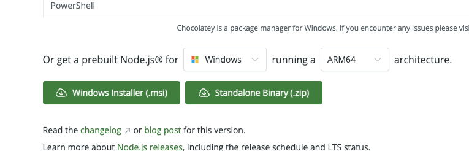

# Initial environment setup

The purpose of this chapter is to do initial setup of test project and to create initial skeleton for further exercises.

Major outcome is:
* Node and NPM is set up
* Initial project skeleton is created with all necessary dependencies set up
* Initial sample test is created and runnable


## Setup Node

Node is one of the core development platforms used for Javascript development. As the result, it's one of the platforms which is core for tests development as well.

In addition to Node itself, the Node Package Manager (NPM) is to be installed. This utility is responsible for retrieving any external components which will further be needed during test development. Normally, both Node and NPM are installed simultaneously.

### MacOS setup

There are several ways of installing Node on MacOS. 

For the project setup purpose they are equivalent. Major thing is that whatever works the better. **If any of the setup types worked, another option is no longer needed.**

Node can be set up via:
* Brew - popular MacOS package manager which can be used for multiple types of applications not limited to Node platform.....
* NVM - Node-specific package manager which can be convenient for Node and NPM upgrade or general management of Node versions

#### Brew installation

Brew (or Homebrew) is package manager which is not normally installed by default. To check if **brew** is installed, run the following command line:

```
brew -v
```

If it is installed the output would be something like:

```
$ brew -v
Homebrew 5.1.5
```

Otherwise, **brew** can be installed using the following command line:

```
curl -o- https://raw.githubusercontent.com/Homebrew/install/HEAD/install.sh | bash
```

Once, **brew** is installed, it's time to install Node which is done via the following command line:

```
brew install node
```

#### NVM installation

NVM installation is also required to be done only once and it can be done using the following command line:

```
curl -o- https://raw.githubusercontent.com/nvm-sh/nvm/v0.40.6/install.sh | bash
```

After that Node can be installed using the command line like:
```
nvm install
```

### Windows setup

For Windows setup it is recommended to use standalone Windows installer which can be found [here](https://nodejs.org/en/download). Just go to **Or get a prebuilt Node.js® for** section at the bottom of the screen, select **Windows** in the list of operating systems. The screen should look like:


Just click on **Windows Installer**, download installer and perform setup as regular Windows application.


### Verifying setup

Once setup is completed, it can be checked by running the following command lines:
```
npm -v
```
and
```
node -v
```

If setup is done correctly, both commands will output versions of dedicated components. E.g. here is sample output:

```
$ node -v
v24.8.0
$ npm -v
11.6.0
```

## Setup Project

## Sample Test