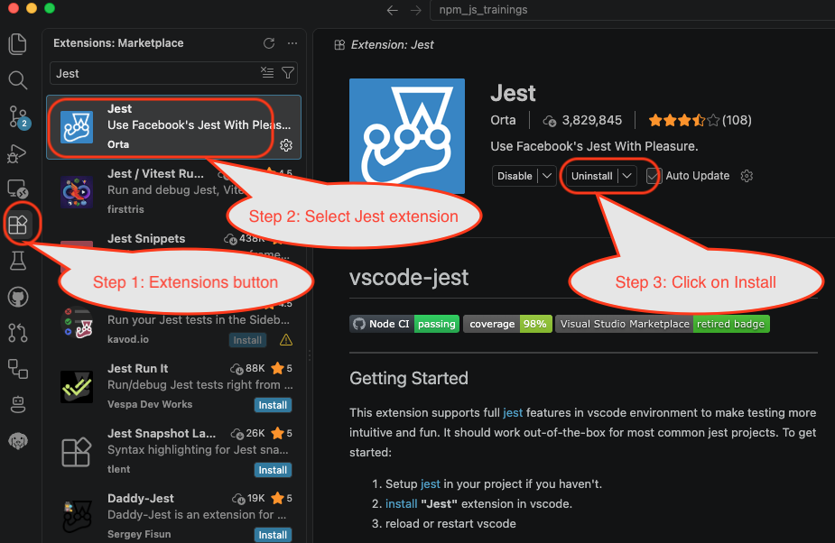
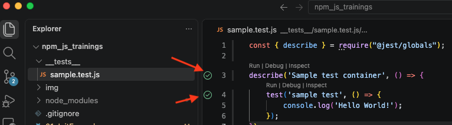

# Initial environment setup

The purpose of this chapter is to do initial setup of test project and to create initial skeleton for further exercises.

Major outcome is:
* Node and NPM is set up
* Initial project skeleton is created with all necessary dependencies set up
* Initial sample test is created and runnable


## Setup Node

Node is one of the core development platforms used for Javascript development. As the result, it's one of the platforms which is core for tests development as well.

In addition to Node itself, the Node Package Manager (NPM) is to be installed. This utility is responsible for retrieving any external components which will further be needed during test development. Normally, both Node and NPM are installed simultaneously.

### MacOS setup

There are several ways of installing Node on MacOS. 

For the project setup purpose they are equivalent. Major thing is that whatever works the better. **If any of the setup types worked, another option is no longer needed.**

Node can be set up via:
* Brew - popular MacOS package manager which can be used for multiple types of applications not limited to Node platform.....
* NVM - Node-specific package manager which can be convenient for Node and NPM upgrade or general management of Node versions

#### Brew installation

Brew (or Homebrew) is package manager which is not normally installed by default. To check if **brew** is installed, run the following command line:

```
brew -v
```

If it is installed the output would be something like:

```
$ brew -v
Homebrew 5.1.5
```

Otherwise, **brew** can be installed using the following command line:

```
curl -o- https://raw.githubusercontent.com/Homebrew/install/HEAD/install.sh | bash
```

Once, **brew** is installed, it's time to install Node which is done via the following command line:

```
brew install node
```

#### NVM installation

NVM installation is also required to be done only once and it can be done using the following command line:

```
curl -o- https://raw.githubusercontent.com/nvm-sh/nvm/v0.40.6/install.sh | bash
```

After that Node can be installed using the command line like:
```
nvm install
```

### Windows setup

For Windows setup it is recommended to use standalone Windows installer which can be found [here](https://nodejs.org/en/download). Just go to **Or get a prebuilt Node.js® for** section at the bottom of the screen, select **Windows** in the list of operating systems. The screen should look like:


Just click on **Windows Installer**, download installer and perform setup as regular Windows application.


### Verifying setup

Once setup is completed, it can be checked by running the following command lines:
```
npm -v
```
and
```
node -v
```

If setup is done correctly, both commands will output versions of dedicated components. E.g. here is sample output:

```
$ node -v
v24.8.0
$ npm -v
11.6.0
```

## VSCode setup

Visual Studio Code (further VSCode) is one of the most popular editors which can be used for tests development. In particular, for Javascript/Node based tests it's one of the most accessible editors.

It is installed as regular desktop applications. Downloads are available [here](https://code.visualstudio.com/Download). Just pick up corresponding installation package and follow installation steps.

### Jest plugin setup

Before continue with project setup, it's good to install additional useful VSCode extension which operates with the Jest, the core test runner which will be used in further chapters. 

Extensions are setup from the left-hand side panel. Steps are:
* On the left-hand side panel, click **Extensions** button
* In the search text field type **Jest**
* Select **Jest** item (should be somewhere in the top) as it's shown on the below screenshot and click on the **Install** button

The overall sequence looks like:



## Setup Project

### Build project skeleton

The last step of preparation is to setup some sample project where all the further code samples will be placed. It should be done with the following steps:

**Step 1:** create some folder where the test project is supposed to be located. In the future, this folder will be called as **project root**.

**Step 2:** open command line and navigate to the project root folder. Once there, run the following set of commands:

```
npm init -y
npm install --save-dev jest
npm install --save-dev @jest/globals
```

After everyting is completed, review the folder contents. Now the project root folder contains 3 new items:
* **node_modules** - the folder which contains necessary external dependencies. It is needed for Node to find all necessary code part. For regular developer this folder just should exist, there's nothing special to look at there
* **package-lock.json** - some temporary dependency cache file. 
* **package.json** - major project file where major setings and references are specified..

### package.json file overview

Since the **package.json** is core project file, it should be described in more details.

If project is set up from the scratch without any other specific settings, the overall content of the **package.json** after previous setup steps should look like:

```json
{
  "name": "test",
  "version": "1.0.0",
  "description": "",
  "main": "index.js",
  "scripts": {
    "test": "echo \"Error: no test specified\" && exit 1"
  },
  "keywords": [],
  "author": "",
  "license": "ISC",
  "type": "commonjs",
  "devDependencies": {
    "@jest/globals": "^30.4.1",
    "jest": "^30.4.2"
  }
}
```
At the moment, most of the content is pretty much generic except the following nodes which will be of our interest. They are:
* scripts
* type
* devDependencies

The **scripts** section contains the list of pre-defined commands supported by project itself. It associates project-specific commands with actual command lines. At the moment, there is just one dummy command **test** which simply prints error message. Later in this chapter it will be updated. The idea is that each script item is supposed to be executed by running the command like this:
```
npm run <script name>
```
where **<\script name>** is actual item name under the **scripts** section.

The **type** field identifies the type of Javascript project it is. Depending on the value, there can be some additional abilities. For training purposes, the **commonjs** as the most generic one is used.

The **devDependencies** section contains external code libraries which we can use from our code. The thing is that the Node itself contains just some core set of available functionality. Lots of other re-usable code are usually provided as some external modules which can be included on demand. Currently, there are just 2 items in there: **jest** and **@jest/globals**. They correspond to relevant external program modules which we can re-use now within our current project.

## Sample Test

And the final step of this chapter is to create some very simple test just in order to present typical test structure and create some minimal runnable sample.

### Sample test code

Firstly, let's put some sample test into the project. For this purpose, let's create the **__tests__** folder under the project root and put **sample.test.js** file in there. This way, the overall project structure looks as follows:
```
<root>
  |
  +- __tests__
  |      |
  |      +- sample.test.js
  |
  +- node_modules
  |
  +- package-lock.json
  |
  +- package.json
```

After that, let's fill the content of the **sample.test.js** file. For now, the content is:

```javascript
const { describe } = require("@jest/globals");

describe('Sample test container', () => {
    test('sample test', () => {
        console.log('Hello World!');
    });
});
```

### Updates to package.json

Last step is to update the **package.json** file to specify which command to run when we need to run tests. Before that the **scripts** section contained only one item which was simply printing some message. In order to make proper test run command we need to replace it with the call of **jest** command. Thus, the **scripts** section now looks as follows:

```json
"scripts": {
    "test": "jest"
  },
```

or the entire **package.json** file looks like that:

```json
{
  "name": "test",
  "version": "1.0.0",
  "description": "",
  "main": "index.js",
  "scripts": {
    "test": "jest"
  },
  "keywords": [],
  "author": "",
  "license": "ISC",
  "type": "commonjs",
  "devDependencies": {
    "@jest/globals": "^30.4.1",
    "jest": "^30.4.2"
  }
}
```

Now we are ready to run our sample test

### Running test

#### Running from command line

Whatever tests we create, they should be runnable from command line. Previously, we made all necessary setup to make our test running. In order to perform test run, we can use the following command line:

```
npm run test
```

It will run all the tests Jest finds. Currently there is just only one test, so the output will include only one test. After the command line run, the output should look like:

```
$ npm run test

> test@1.0.0 test
> jest

  console.log
    Hello World!

      at Object.log (__tests__/sample.test.js:5:17)

 PASS  __tests__/sample.test.js
  Sample test container
    ✓ sample test (22 ms)

Test Suites: 1 passed, 1 total
Tests:       1 passed, 1 total
Snapshots:   0 total
Time:        0.291 s, estimated 1 s
Ran all test suites.

```

Once the output is like that, all the setup is done properly.

#### Running from VSCode

So far, only single and simple test was created but during normal development there will be lots of tests. Also, previous command line runs all the available tests, however, during test development we mainly need to run just single test or group of tests we are working on at the moment. That's why it is convenient to use VSCode for this purpose.

Once all necessary extensions are installed and all the code is written, we can open our **sample.test.js** file in the VSCode and look at the left side of the lines containing **describe** and **test** keywords. They both should contain clickable icons which can run tests. Here is how they can look like:



If you click on any of arrow pointed icons, the corresponding test will be run.

## Summary

In this chapter we are supposed to have:
* Fully setup Node environment
* Properly setup VSCode for writing our code
* Sample Javascript test project skeleton
* Sample test which can be run both from command line and VSCode
